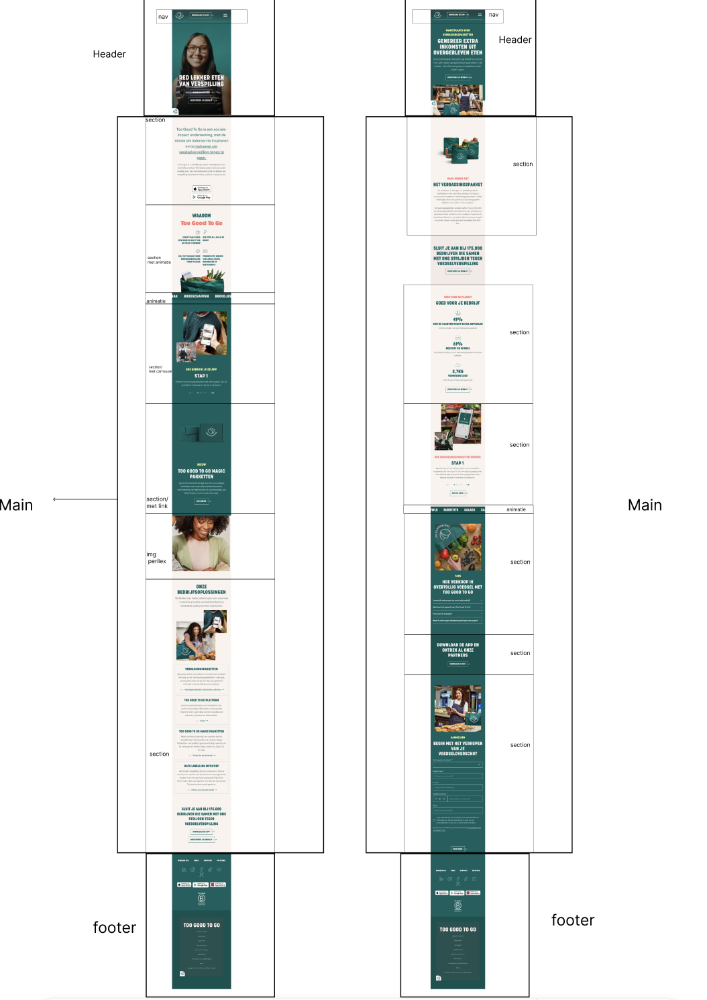
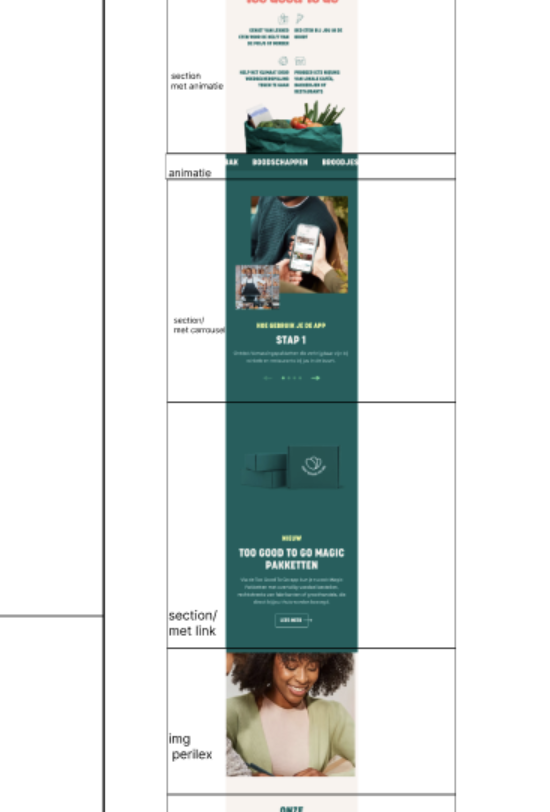
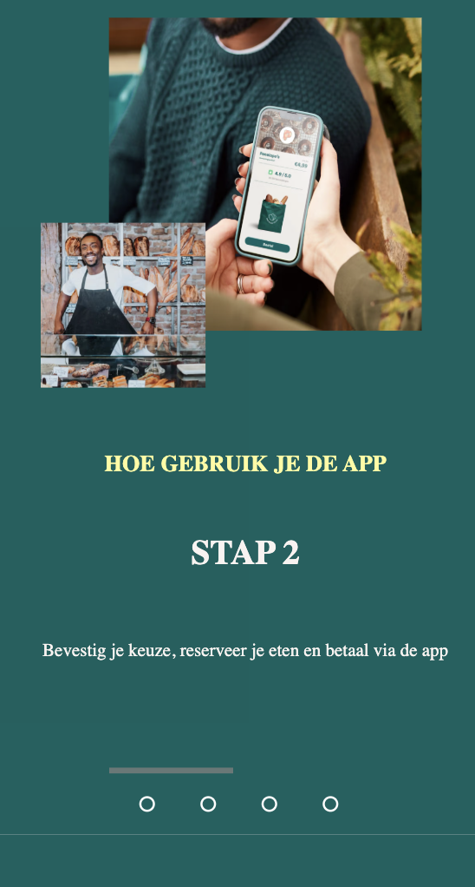
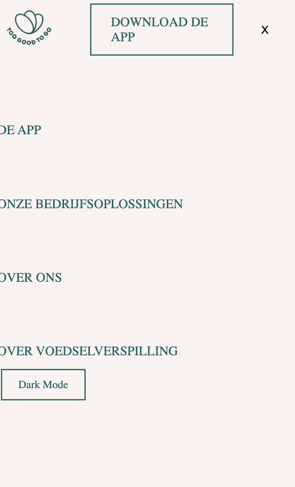
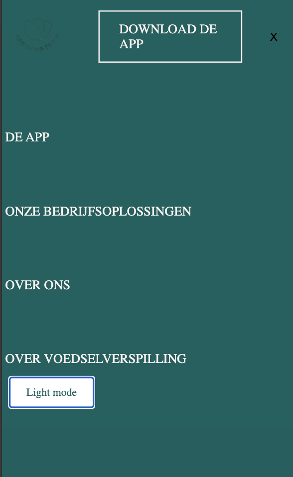
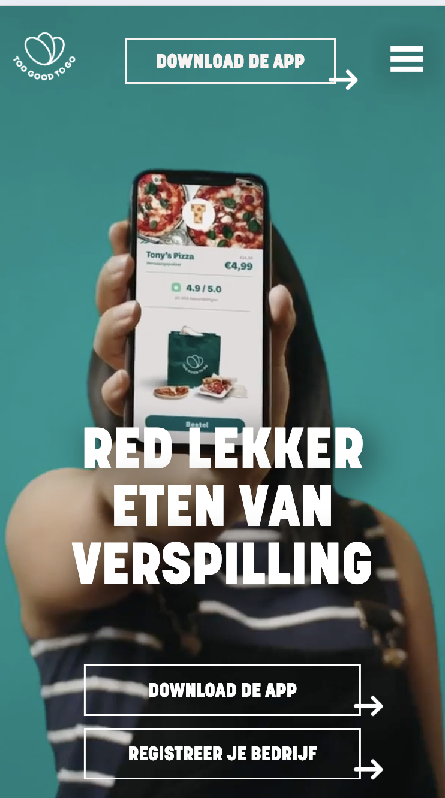

# Procesverslag
Markdown is een simpele manier om HTML te schrijven.  
Markdown cheat cheet: [Hulp bij het schrijven van Markdown](https://github.com/adam-p/markdown-here/wiki/Markdown-Cheatsheet).

Nb. De standaardstructuur en de spartaanse opmaak van de README.md zijn helemaal prima. Het gaat om de inhoud van je procesverslag. Besteedt de tijd voor pracht en praal aan je website.

Nb. Door *open* toe te voegen aan een *details* element kun je deze standaard open zetten. Fijn om dat steeds voor de relevante stuk(ken) te doen.

## Jij

  
uitwerken voor kick-off werkgroep

  ### Auteur:
  Nadine Luycks 

  #### Je startniveau:
  Blauw (baby piste)

  #### Je focus:
  animeren surface plane
 

## Je website

  
Website too good to go

  ### Je opdracht:
  link naar de website die je gaat namaken óf de naam/omschrijving van je eigen ontwerp
  
  Coldplay.html

  #### Screenshot(s) van de eerste pagina (small screen): 
  home pagina 
  

  #### Screenshot(s) van de tweede pagina (small screen):
verassingspakketten 
  
 

## Toegankelijkheidstest 1/2 (week 1)

  
uitwerken na test in 2e werkgroep

  ### Bevindingen
  Lijst met je bevindingen die in de test naar voren kwamen:

  website is redelijk te lezen met een wazige bril op
  met vingers vastgebonden elastiekje is de website makkelijk te navigeren.
  voor de voice over is de website bijna niet te volgen. De navigatie balk wordt niet voorgelezen en hij blijft hangen bij kopstuk 1 van de website daarna is het niet mogelijk om verder naar beneden te gaan. 
  het is niet mogelijk om met het toetsenbord door de website heen te navigeren. 

## Breakdownschets (week 1)

  
uitwerken na afloop 3e werkgroep

  ### de hele pagina: 
  

  ### dynamisch deel (bijv menu): 
  

  ### wellicht nog een dynamisch deel (bijv filter): 
  

## Voortgang 1 (week 2)

  
uitwerken voor 1e voortgang

  ### Stand van zaken
 Ik vond het maken van mijn html code goed gaan dit was makkelijk te doen doordat wij al de breakdown schetsen hadden gemaakt. Ik moest goed opletten dat de sections buiten de articles staan. en goed kijken naar dat de code semantisch correct neergezet werd. ik had perongeluk de h4 boven de h3 gezet omdat ik dacht dat dat makkelijker zou zijn voor mijn vormgeving maar dit heb ik toch weer aangepast. 

  ### FEEDBACK SESSIE
  Check nog ff dat alle headings op de juiste volgorde staan, dus h1,h2,h3 etc. De grootte van de tekst mag je vergroten en verkleinen in CSS, dat is geen probleem.

 
Oh en kijk even of je de code wat beter kan laten inspringen, Danny is daar ook blij mee als hij volgende alles moet lezen. 
 
importeer ook nog even je font!
 

## Voortgang 2 (week 3)

  
uitwerken voor 2e voortgang

  ### Stand van zaken
  Ik ben hier bezig geweest om mijn css en html te linken aan elkaar en de afbeeldingen op de juiste plek te zetten. Ik had heel veel moeite met de grid neerzetten zodat de foto's netjes elkaar overlapde op de juiste manier. Door de hulp van Danny is het mij gelukt en kon ik voor mijn tweede pagina het zelf gelukkig. Ik had ook allemaal hovers op alle links toegevoegd maar kwam toen tot de conclusie dat ik een telefoon variant maakte waarbij dat helemaal niet nodig is. dus die heb ik weer verwijderd. Het kost allemaal veel meer tijd dan ik dacht waardoor ik een beetje achterloop. Ook lukken grotendeels van de stijlen niet waardoor ik elke keer vastloop en niet verder kan. 

  ### Agenda voor meeting
  samen met je groepje opstellen

  Ik wil deze sessie even feedback halen bij Danny kijken wat hij ervan vind, en of mijn html en css tot nu toe kloppen. 

  ### Verslag van meeting
  Een niet al te best gesprek! ik loop mega achter, wat er staat is wel goed maar ik moet nog een hamburger menu, footer, en de styling van pagina twee verder afmaken daarnaast alle interacties op de site zijn nog niet getoond. Maak een lijstje met to do's en werk daar rustig aan verder. werk de pixels weg en schrijf daar relative unites voor. Maak gebruik van custom properties

## Toegankelijkheidstest 2/2 (week 4)

  
uitwerken na test in 9e werkgroep

  ### Bevindingen
 mist nog veel labels van de fotos heb ik er nog niet in gezet! pagina is wel klikbaar.

## Voortgang 3 (week 4)

  
uitwerken voor 3e voortgang

  ### Stand van zaken
 Heb de labels toegevoegd aan de foto's pagina twee begint ergens op te lijken. Ik loop helemaal vast op mijn hamburger menu hij wil maar niet naast elkaar gaan staan en ook de linear gradient valt niet over de video deze krijg ik onder geen mogelijkheid goed. Ik snap niks van de roots dus heb het allemaal handmatig gehouden. 

  ### Agenda voor meeting
 Voor de werkgroep wou ik pagina 2 afhebben zodat ik aan de surface plane kon beginnen. 

  ### Verslag van meeting
  Ik heb de pagina's deels af kunnen krijgen ik krijg de font niet meer naar github hierdoor blijft het in New Times Roman. mijn hamburger menu is nog niet compleet ik heb nu wel dat die opent maar nog niet kunnen stylen. Ook moet ik nog de surface planes maken. 

## Eindgesprek (week 5)

  
uitwerken voor eindgesprek

  ### Je uitkomst - karakteristiek screenshots:
  

  ### Dit ging goed/Heb ik geleerd: 
  Het maken van de dark light mode ging beter dan verwacht ook ben ik heel blij met mijn carrousel die ik gemaakt heb! de foto's in de grid zetten was best lastig maar toen ik eenmaal doorkreeg hoe de grid werkte lukte dit mijn aardig, hierdoor kon ik alle fotos op een rij zetten en een daarvan een carrousel maken. daarna heb ik de knopjes zo gestyled dat het een beetje lijkt op die van de originele website maar het lukte mij niet om die pijltjes ernaast te zetten. 

  

  ### Dit was lastig/Is niet gelukt:
 Ik probeerde de peiltjes bij de linkjes te plaatsen dit is mij niet gelukt ik kreeg ze er wel op doormiddel van een grid te gebruiken maar ik vond de afwerking er zo lelijk van dat het niet de moeite waard was om het op de website te houden tevens werden de link buttons zo groot dat ze bijna niet meer op de pagina paste. 

 Ook krijg ik de fonts niet geladen op de website eerst deed die het op mijn computer wel maar toen liep mijn github desktop vast op mijn eerste versie en werkte die niet bij toen dacht ik dat ik alles kwijt was toen vond ik mijn huidige versie weer echter kan ik de fonts nu helemaal niet meer zien. ik heb aan chat gpt gevraagd waarom die het niet doet maar die weet het ook niet. 

  
  

## Bronnenlijst

  
continu bijhouden terwijl je werkt

Ik heb heel veel hulp gekregen van de student assistentes. 

  Nb. Wees specifiek ('css-tricks' als bron is bijv. niet specifiek genoeg). 
  Nb. ChatGpT en andere AI horen er ook bij.
  Nb. Vermeld de bronnen ook in je code.

  1.  https://www.w3schools.com/css/tryit.asp?filename=trycss_form_responsive 
  2. https://www.w3schools.com/howto/howto_css_custom_checkbox.asp 
  3. https://www.w3schools.com/howto/howto_js_toggle_dark_mode.asp 
  4. https://codepen.io/dmr0m/pen/VYeeVQX (gemaakt door student assistent Damian)
  5. https://css-tricks.com/css-only-carousel/
  6. 

